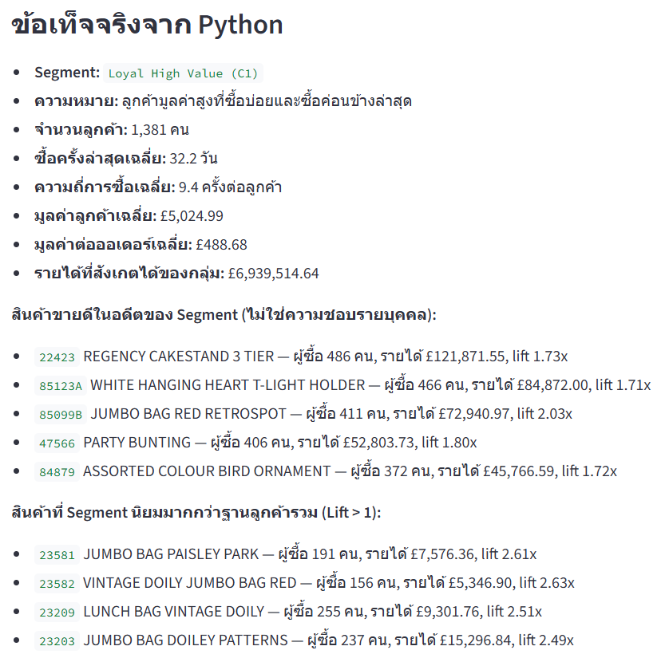

# Acceptance Tests

## Release status

Core portfolio flow: **PASS**

| Area | Acceptance criterion | Evidence | Status |
|---|---|---|---|
| PostgreSQL | Dashboard loads the validated transaction table | 392,692 clean rows displayed | PASS |
| Import audit | Original row count survives database loading | 541,909 raw and 149,217 removed | PASS |
| Feature engineering | Customer and order totals are reproducible | 4,338 customers and 18,532 orders | PASS |
| Model selection | Automatic K uses recorded diagnostics | K=3, silhouette 0.259, stability 0.994 | PASS |
| Audience usability | No selected cluster is extremely small | Smallest cluster share 27.7% | PASS |
| Targeting | Business objective maps to a Python-ranked segment | Target and score table shown in UI | PASS |
| Product grounding | Product comes from observed segment transactions | Product evidence table and stock code displayed | PASS |
| Overall product ranking | Natural language selects revenue, units, orders, or customer ranking | Intent and aggregate tool tests | PASS |
| Product catalog semantics | Count questions do not route to Top 10 and missing categories are not invented | Intent, catalog, and MCP contract tests | PASS |
| Analyst intent | Natural-language request becomes an allow-listed structured intent | Intent JSON and parser source shown in UI | PASS |
| Analyst routing | Python dispatches only approved analytical functions | Ordered tool trace shown in UI | PASS |
| Analyst evidence | Counts, money, rates, and diagnostics remain Python-calculated | Expandable evidence block shown in UI | PASS |
| Analyst fallback | Invalid model intent or numeric narrative fails closed | Covered by adversarial tests | PASS |
| Semantic routing | LLM cannot redirect an explicit campaign request to a predictive action | Adversarial routing test | PASS |
| Numeric safety | NaN, infinity, and revenue overflow are rejected before ML | Data-quality test | PASS |
| Structured generation | LLM returns message-only JSON | Schema validated before rendering | PASS |
| Locked configuration | Product, channels, and control group cannot be changed by LLM | Locked configuration shown before generation | PASS |
| Repair | Invalid first LLM result receives one retry | Covered by adversarial test | PASS |
| Safe plan | Two invalid results activate same-configuration Python copy | Covered by adversarial test | PASS |
| Simulator | Discount-aware scenario arithmetic is correct | Covered by unit test | PASS |
| Temporal leakage | Future purchases affect labels but never historical features | Dedicated synthetic leakage test | PASS |
| Churn prediction | 90-day aggregate risk scores and temporal metrics validate against schema | Business-tool integration test | PASS |
| Repeat prediction | 30-day scores can be restricted to an aliased segment | Thai intent and service tests | PASS |
| Revenue forecast | Requested 1–12 week horizon and baseline comparison are returned | Predictive integration test | PASS |
| Forecast selection | Lowest-MAE candidate is selected from Ridge and two simple baselines | Integration assertion | PASS |
| Incomplete week | Trailing partial week is excluded before model fitting | Time-boundary test | PASS |
| Recursive forecast safety | Infinity is replaced before becoming a future lag | Stress regression test | PASS |
| Predictive privacy | Predictive MCP responses expose aggregates, not customer IDs | Contract test | PASS |

## Screenshot evidence

### Data-quality audit


### Model selection


### Segment product evidence



### Locked and validated campaign


## Automated tests

Run locally:

```powershell
.\.venv\Scripts\python.exe -m pytest -q
```

Expected result:

```text
54 passed
```

The tests cover cleaning, non-finite and overflow values, mixed date formats, sub-cent prices, feature aggregation, segmentation, catalog counting without invented categories, overall and segment product ranking, product lift, targeting, analyst intent parsing, semantic routing, tool routing, temporal leakage, churn and repeat scoring, revenue forecasting, predictive schemas, numeric-narrative rejection, structured campaign constraints, invalid JSON repair, deterministic fallback, unsupported claims, and simulator arithmetic.

## Manual release check

Before recording a demo:

1. Start PostgreSQL and Streamlit.
2. Select PostgreSQL and confirm the raw/clean counts above.
3. Leave K on Auto and confirm K=3.
4. Run each business objective once.
5. Ask one question in the AI Analyst tab and inspect its intent, evidence, and tool trace.
6. Confirm the displayed product appears in every generated channel message.
7. Confirm the displayed control-group value appears once in the locked plan and no treatment-group value is generated.
8. Download the validated plan and confirm rejected model text is absent.
9. Ask the three predictive example questions and inspect the horizon, validation metrics, and tool trace.
